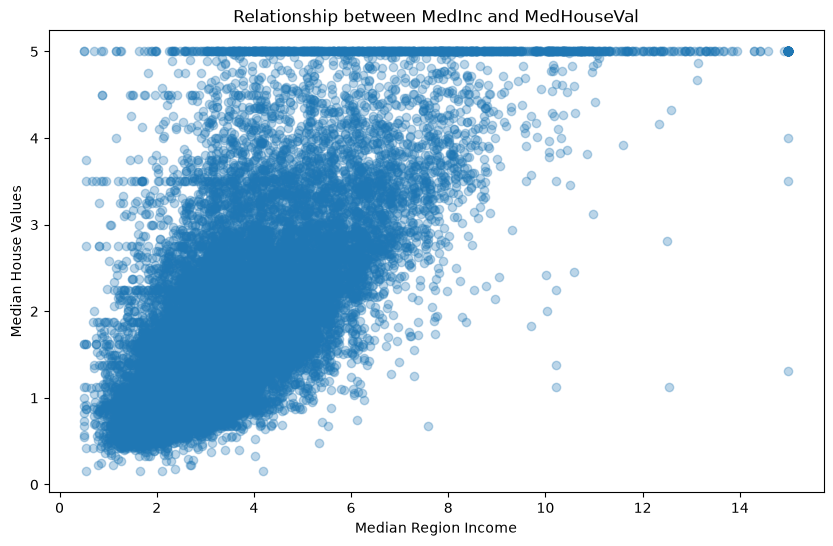
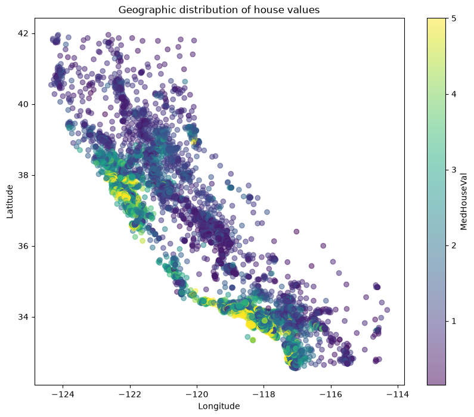
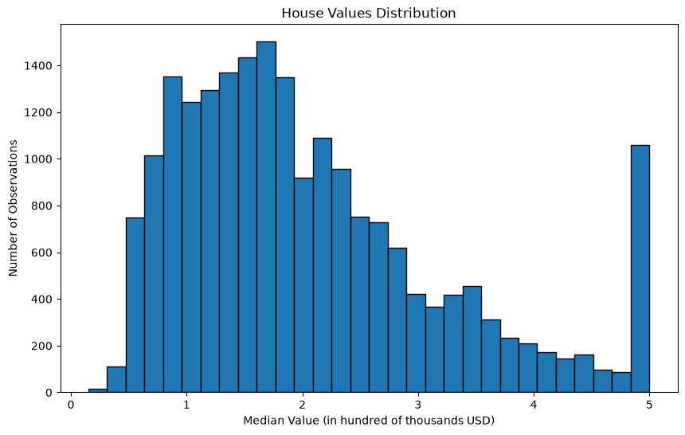
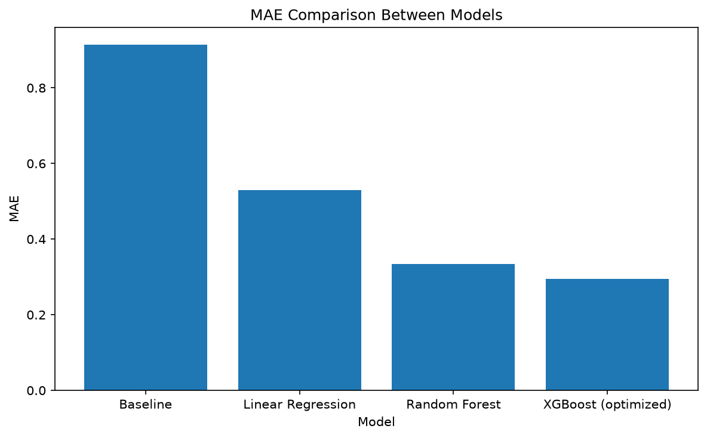
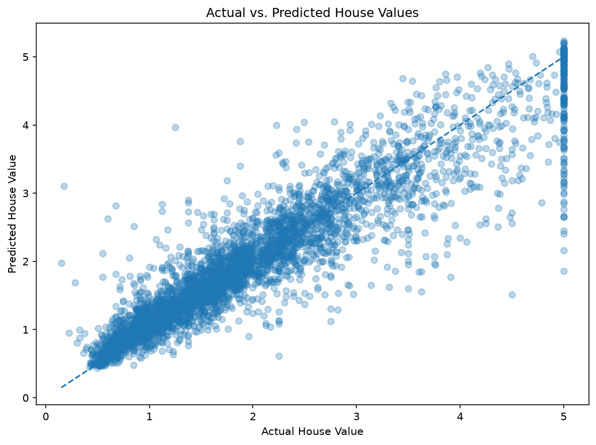
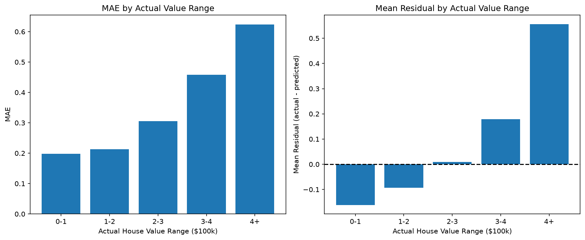
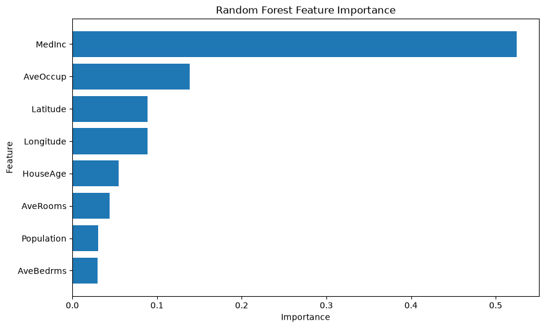

# Real Estate Analytics Project


## 1. Project Description

This project combines exploratory data analysis and machine learning to investigate factors associated with real estate prices in California, using the California Housing dataset as a case study.

Three machine learning models are evaluated: Linear Regression, Random Forest Regressor, and an optimized XGBoost pipeline, compared against a baseline that predicts the mean house value.

## 2. Dataset

The California Housing dataset (from Scikit-learn, based on the 1990 U.S. Census) contains 20,640 observations and 9 columns: 8 features (median income, house age, average rooms, average bedrooms, population, average occupancy, latitude, longitude) and the target variable `MedHouseVal` (median house value).

## 3. Objective

Investigate which characteristics are associated with house values, and evaluate whether machine learning models can predict them accurately.

The project addresses three main questions:
1. Which variables show the strongest relationship with house values?
2. Can socioeconomic, demographic, and geographic information predict house values?
3. Which model provides the most accurate predictions?

## 4. Technologies and Tools

- **Language:** Python 3.14
- **Data:** Pandas, NumPy, SciPy
- **ML:** Scikit-learn, XGBoost
- **Visualization:** Matplotlib, Seaborn
- **Development:** Jupyter Notebook, Pytest, Ruff, GitHub Actions

## 5. Workflow and Architecture

The project follows a standard ML workflow:

1. **Train/test split (80/20):** single split with fixed seed for reproducibility.
2. **Cross-validation:** 5-fold on the training set to select models and tune hyperparameters.
3. **Preprocessing:** `ColumnTransformer` inside each pipeline (median imputer for numeric features) to prevent data leakage.
4. **Model comparison:** mean MAE across CV folds, final evaluation on untouched test set.
5. **Error analysis:** residuals, by-value-range metrics, and target-cap investigation.

Reusable code in `src/` (`data.py`, `preprocessing.py`, `pipeline.py`, `models.py`, `cv.py`, `tuning.py`, `evaluation.py`, `analysis.py`, `visualization.py`); reproducible scripts in `scripts/`.

## 6. Insights

Key patterns from exploratory data analysis:

1. **Median income** is the strongest predictor of house value (correlation 0.69).

<p align="left">
  
</p>

2. **Geographic location** carries information: coastal regions show higher house values, though this was not formally quantified.

<p align="left">
  
</p>

3. **Target cap:** approximately 4.8% of observations are censored at US$500,000, which affects model performance on high-value houses.

<p align="left">
  
</p>

4. **Non-linear relationships:** Random Forest substantially outperformed Linear Regression (CV MAE 0.335 vs 0.529), indicating non-linear patterns.

## 7. Models

- **Baseline:** predict the mean training value for all test samples (MAE 0.914).
- **Linear Regression:** interpretable baseline model (MAE 0.529).
- **Random Forest:** captures non-linear patterns (MAE 0.335).
- **XGBoost:** gradient-boosted trees, default and optimized (MAE 0.316 → 0.294 after tuning).

### Hyperparameter optimization

The XGBoost hyperparameters were tuned with RandomizedSearchCV, which samples a fixed number of configurations from predefined ranges instead of testing every combination.

The search used 20 sampled configurations, each scored with the 5-fold cross-validated MAE on the training set only. Cross-validation estimates how each configuration generalizes without touching the test set.

The searched ranges are defined in `src/tuning.py` (`n_estimators`, `max_depth`, `learning_rate`, `subsample`, `colsample_bytree`, `min_child_weight`, `gamma`, `reg_alpha` and `reg_lambda`).

The best configuration was refitted on the full training set and evaluated once on the test set:

| Hyperparameter | Selected value |
|---|---:|
| `n_estimators` | 307 |
| `max_depth` | 8 |
| `learning_rate` | 0.0476 |
| `min_child_weight` | 5 |
| `subsample` | 0.876 |
| `colsample_bytree` | 0.798 |
| `gamma` | 0.0004 |
| `reg_alpha` | 0.0095 |
| `reg_lambda` | 3.46 |

These values are the result of a limited random search (20 samples) on this dataset and split; they should not be interpreted as universally optimal. A different seed or larger search could select a different configuration. The full search summary is saved in `outputs/xgb_random_search.json` and can be reproduced with `python -m scripts.xgb_tuning`.

------

## 8. Results and Performance

The models were evaluated using **Mean Absolute Error (MAE)**, where lower values indicate predictions that are, on average, closer to the **actual house values**. The target is expressed in units of US$100,000, so an MAE of 0.29 corresponds to an average error of approximately US$29,000.

Cross-validation (CV) results are the mean MAE over 5 folds of the training set, and test results come from the untouched test set (4,128 observations). Each column must be compared only with itself.

| Model | CV MAE (mean ± std) | Test MAE | Test error (USD) |
|---|---:|---:|---:|
| Baseline (mean of training target) | 0.914 ± 0.010 | 0.906 | ~US$90,600 |
| Linear Regression | 0.529 ± 0.009 | 0.533 | ~US$53,300 |
| Random Forest | 0.335 ± 0.005 | 0.328 | ~US$32,800 |
| XGBoost (default parameters) | 0.316 ± 0.007 | 0.311 | ~US$31,100 |
| **XGBoost (optimized)** | **0.294 ± 0.005** | **0.290** | **~US$29,000** |

The **optimized XGBoost** pipeline achieved the lowest MAE in both cross-validation and the final test evaluation. The CV and test values are close for every model, which suggests the selection process did not overfit the training folds.

<p align="left">
   
</p>

The chart shows the cross-validation MAE of each model.

* Compared to the baseline, the optimized XGBoost reduced the test error by approximately **67.99%**.

* Compared to Random Forest, the optimized XGBoost reduced the test error by approximately **11.53%**.

* Compared to the default XGBoost, tuning reduced the test error by approximately **6.66%**.

------

### Error analysis

The errors of the optimized XGBoost were analyzed on the test set (details in [docs/error_analysis.md](docs/error_analysis.md); reproducible with `python -m scripts.error_analysis`):

* The residuals (actual − predicted) are centered near zero (mean −0.001), but they are positively skewed: most predictions are close (median absolute error 0.184), while a minority of large under-predictions raises the MAE to 0.290.
* The error **increases with the house value**: MAE is 0.198 for houses valued up to US$100,000 and 0.623 for houses above US$400,000.
* Houses above US$400,000 are 8.2% of the test samples but account for 17.6% of the total absolute error, and the model tends to **under-predict** them.
* Observations at the **target cap** (US$500,000) have an MAE of 0.629, against 0.274 for the remaining observations.

<p align="left">
   
</p>

The points follow the diagonal, and the horizontal band at the actual value of 5.0 corresponds to the capped observations.

<p align="left">
   
</p>

### Feature importance

The **feature importance** of the **Random Forest Regressor** (impurity-based, from the modelling notebook) was used to interpret which variables the model relied on. It was not computed for the final XGBoost model.

<p align="left">
  
</p>

* `MedInc` showed the highest importance (about 52.5% of the total), consistent with its strong correlation with `MedHouseVal` in the exploratory analysis.
* `AveOccup` (13.8%), `Latitude` (8.9%) and `Longitude` (8.9%) came next. The two coordinates together contribute about 17.7%, which suggests that location carries information about house values beyond what the linear correlations show.
* Feature importance describes how much the model used each variable, not a causal effect on house prices.

## 9. Limitations and Future Work

- **Target censoring:** the upper limit at US$500,000 affects high-value predictions (MAE 0.629 vs 0.274 below the cap).
- **Historical data:** based on 1990 Census; does not reflect current market.
- **Simple features:** limited feature engineering; could explore richer predictors, geographic segmentation, or temporal data.
- **Future:** advanced imputation, gradient boosting with censoring support, more recent datasets, API deployment.

## 10. Getting Started

Python 3.14.7; all dependency versions are pinned in `requirements.txt` and `requirements-dev.txt`.

```bash
# Setup
git clone https://github.com/IsacFreitaas/real-estate-analytics-project
cd real-estate-analytics-project
python -m venv .venv
source .venv/bin/activate  # Windows: .venv\Scripts\activate
pip install -r requirements.txt

# Explore
jupyter notebook  # Run 1. EDA.ipynb, then 2. Modelling.ipynb

# Reproduce
python -m scripts.model_comparison
python -m scripts.xgb_tuning
python -m scripts.error_analysis

# Test (with requirements-dev.txt)
pip install -r requirements-dev.txt
python -m pytest
ruff check .
```

Reusable code in `src/`; notebooks document the exploratory workflow.

## 11. Continuous Integration

GitHub Actions (`.github/workflows/ci.yml`) runs Ruff and Pytest on every push and PR targeting `develop`/`main`. Introducing automated linting revealed existing style issues that were corrected, ensuring consistent code quality.

## 12. Project Organization

```text
real-estate-analytics-project
├── .github/workflows/
│   └── ci.yml
├── docs/
│   ├── error_analysis.md
│   ├── repo_review.md
│   └── reproducibility.md
├── images/
│   ├── error-analysis/
│   └── (EDA, model comparison and thumbnail images)
├── notebooks/
│   ├── 1. EDA.ipynb
│   └── 2. Modelling.ipynb
├── outputs/
│   ├── error_analysis/
│   └── (CV, test and tuning results in JSON)
├── scripts/
│   ├── check_repro.sh
│   ├── cv_demo.py
│   ├── error_analysis.py
│   ├── model_comparison.py
│   ├── pipeline_demo.py
│   └── xgb_tuning.py
├── src/
│   ├── __init__.py
│   ├── analysis.py
│   ├── cv.py
│   ├── data.py
│   ├── evaluation.py
│   ├── models.py
│   ├── pipeline.py
│   ├── preprocessing.py
│   ├── repro.py
│   ├── tuning.py
│   └── visualization.py
├── tests/
│   ├── __init__.py
│   ├── test_data.py
│   ├── test_evaluation.py
│   └── test_pipeline.py
├── .gitattributes
├── .gitignore
├── pyproject.toml
├── README.md
├── requirements.txt
├── requirements-dev.txt
└── requirements-locked.txt
```

- **`notebooks/`:** Exploratory Data Analysis (1. EDA.ipynb) and initial modelling with baseline, Linear Regression and Random Forest (2. Modelling.ipynb).
- **`src/`:** Reusable modules for data loading, preprocessing, model pipelines, cross-validation, tuning, evaluation, error analysis, and visualization.
- **`scripts/`:** Reproducible entry points: `model_comparison.py` (CV and test evaluation), `xgb_tuning.py` (hyperparameter search), `error_analysis.py` (error decomposition).
- **`tests/`:** Pytest tests for data integrity, MAE calculation, and pipeline behavior.
- **`outputs/`:** JSON/CSV results and `images/error-analysis/` for diagnostic plots.

## 13. Contact

- LinkedIn: https://www.linkedin.com/in/isac-freitas-16a035223/
- Email: isaczeitgeist+contatogithub@gmail.com

<p>
  
</p>