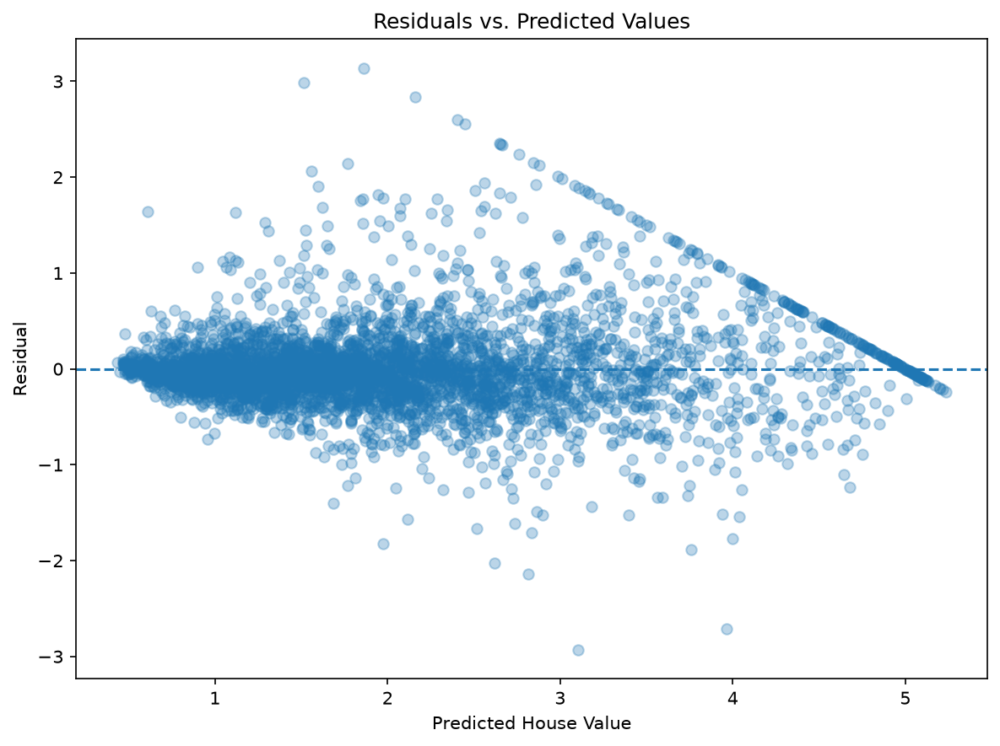

# Error Analysis

Descriptive analysis of the prediction errors of the optimized XGBoost pipeline on the untouched test set (4,128 observations, test MAE 0.290). The target is expressed in units of US$100,000.

The pipeline was rebuilt from the best parameters recorded in `outputs/xgb_random_search.json` and fitted on the training split only. The test set was used only to describe errors; no decision was made from it.

Reproduce with:

```bash
python -m scripts.error_analysis
```

Residual is defined as `actual - predicted`: positive values mean the model under-predicted.

## 1. Residuals

| Statistic | Value |
|---|---:|
| MAE | 0.290 |
| Median absolute error | 0.184 |
| 90th percentile of absolute error | 0.667 |
| 99th percentile of absolute error | 1.717 |
| Residual mean | -0.001 |
| Residual skewness | 1.052 |

- The mean residual is close to zero, so there is no strong overall bias.
- The median absolute error (0.184) is well below the MAE (0.290), and the residuals are positively skewed: most predictions are close, while a minority of large under-predictions raises the average error.
- The residuals-vs-predicted plot shows a funnel shape: errors are more spread out for higher predicted values.




## 2. Error by actual value range

| Range ($100k) | Samples | Share of samples | MAE | Mean residual | Share of total error |
|---|---:|---:|---:|---:|---:|
| 0-1 | 739 | 17.9% | 0.198 | -0.161 | 12.2% |
| 1-2 | 1,682 | 40.7% | 0.214 | -0.093 | 30.0% |
| 2-3 | 956 | 23.2% | 0.305 | 0.009 | 24.4% |
| 3-4 | 412 | 10.0% | 0.458 | 0.179 | 15.8% |
| 4+ | 339 | 8.2% | 0.623 | 0.556 | 17.6% |

- MAE increases with the actual house value, from 0.198 to 0.623.
- Houses valued above 4 represent 8.2% of the test samples but 17.6% of the total absolute error.
- The mean residual is negative for low values (over-prediction) and positive for high values (under-prediction), which suggests predictions are pulled toward the center of the target distribution.


## 3. Target cap

In the full dataset, 992 observations (4.8%) have a target of at least 5.0, and 965 of them share the exact value 5.00001. This is consistent with a censored target at about US$500,000. The following describes the 184 test observations with `actual >= 5.0`:

| Group | Samples | MAE | Mean residual |
|---|---:|---:|---:|
| At the cap (`actual >= 5.0`) | 184 (4.5%) | 0.629 | 0.591 |
| Below the cap | 3,944 | 0.274 | -0.029 |

- Capped observations account for 9.7% of the total absolute error while being 4.5% of the samples.
- Their mean prediction is 4.41, and 22.8% of them are predicted below 4.0, so the model often under-predicts them. The maximum prediction on the test set is 5.24, so the model does not hard-limit its output at the cap.
- The true value of a capped observation is only known to be at least 5.0. The reported error for these rows therefore reflects the recorded (censored) value rather than the actual market price.

## 4. Interpretation and caveats

- All findings are descriptive and based on a single test split; the analysis does not establish causes.
- The higher error for expensive houses is associated with both the sparsity of high-value observations and the censoring at the cap, but this analysis does not separate the two effects.
- Possible follow-ups: loss functions or models that handle censored targets, additional features for high-value areas, and evaluating on data from other regions or periods.
